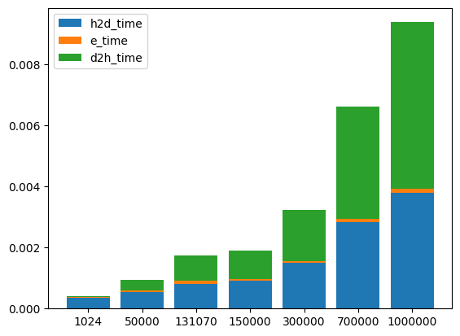

#  Assignment II: CUDA Basics I

### Exercise 1 - Your first CUDA program and GPU performance metrics

#### 1. Explain how the program is compiled and run. 

First, we need to compile the program(.c) with the NVIDIA CUDA compiler (nvcc)

```nvcc -arch=sm_75 lab2exercise1.cu -o exercise1.out```

Then we need to run the compiled executable file directly. The first execution parameter is the file name and the second is the input length of the vector we need to calculate.

```./exercise1.out <InputLength>```


#### 2. For a vector length of N:

##### 1. How many floating operations are being performed in your vector add kernel?

   For the vector length of N, the total number of floating-point operations is 2N, N addition, and N assignment respectively.
   
   At each thread, we just have one addition and one assignment.
   
##### 2. How many global memory reads are being performed by your kernel?

There are N global reads performed by our kernel totally and two in each thread, since the ```cudamalloc()``` function will allocate vector into global space at GPU.

#### 3. For a vector length of 1024:
##### 1. Explain how many CUDA threads and thread blocks you used.

In our program, the number of thread per block is defined as 256. So the number of thread blocks that we used should be: [(1024 + 256 - 1)/256] = 4.

##### 2. Profile your program with Nvidia Nsight. What Achieved Occupancy did you get?

As the figure below shows, the achieved occupancy is: 17.32%.


#### 4 .Now increase the vector length to 131070:

##### 1. Did your program still work? If not, what changes did you make?

Still work. We changed the number of thread per block as: 1024 so that the number of block would not be too large. 

##### 2. Explain how many CUDA threads and thread blocks you used.

Since the number of thread per block is defined as: 1024. The number of thread block that we used is: [(131070 + 1024 - 1 )/1024] = 128.

##### 3. Profile your program with Nvidia Nsight. What Achieved Occupancy do you get now?

As the figure below shows, the achieved occupancy is: 78.03%.


#### 5. Further increase the vector length (try 6-10 different vector length), plot a stacked bar chart showing the breakdown of time including (1) data copy from host to device (2) the CUDA kernel (3) data copy from device to host. For this, you will need to add simple CPU timers to your code regions.

As the vector length increases, the time for data copying from host to device and data copying from device to host increase almost linearly, but the execution time in the kernel remains stable with negligible time consumption. 

| input size      |     1024 |    50000 |   131070 |   150000 |   300000 |   700000 |   1000000 |
|-----------------|----------|----------|----------|----------|----------|----------|-----------|
| h2d_time        | 0.000353 | 0.000542 | 0.000816 | 0.000903 | 0.001501 | 0.002825 |  0.003782 |
| execution _time | 3.2e-05  | 5.1e-05  | 9.5e-05  | 6.5e-05  | 6.1e-05  | 9.9e-05  |  0.000132 |
| d2h_time        | 2.5e-05  | 0.000338 | 0.000817 | 0.000926 | 0.001672 | 0.003674 |  0.005454 |




### Exercise 2 - 2D Dense Matrix Multiplication

#### 1. Name three applications domains of matrix multiplication.

1. Deep learning: In the convolution and fully connected layers of the neuron network, matrix multiplication is necessary.
2. digital signal processing like FFT, DCT, and so on.
3. SLAM: in the karma filter, matrix multiplication is used to update the state.

#### 2. How many floating operations are being performed in your matrix multiply kernel? 

We assume that the sizes of the two matrices multiplied are a * b and b * c respectively, and the matrix size we obtained is a * c. For each element in the result matrix, b multiplication floating operations, (b-1) addition floating operations and 1 assignment operation are required respectively, that is, a total of 2b operations. For a * c elements, a total of 2b * a * c operations are required.

#### 3. How many global memory reads are being performed by your kernel?  


#### 4. For a matrix A of (128x128) and B of (128x128):

##### 1. Explain how many CUDA threads and thread blocks you used.

In the program, we define the number of thread per block as: 16 * 16 = 256. The number of block should be: [(128+16-1)/16]^2 = 64.
  
##### 2. Profile your program with Nvidia Nsight. What Achieved Occupancy did you get?

#### 5. For a matrix A of (511x1023) and B of (1023x4094):

##### 1. Did your program still work? If not, what changes did you make?

##### 2. Explain how many CUDA threads and thread blocks you used.

##### 3. Profile your program with Nvidia Nsight. What Achieved Occupancy do you get now?

#### 6. Further increase the size of matrix A and B, plot a stacked bar chart showing the breakdown of time including (1) data copy from host to device (2) the CUDA kernel (3) data copy from device to host. For this, you will need to add simple CPU timers to your code regions. Explain what you observe.

#### 7. Now, change DataType from double to float, re-plot the a stacked bar chart showing the time breakdown. Explain what you observe. 
