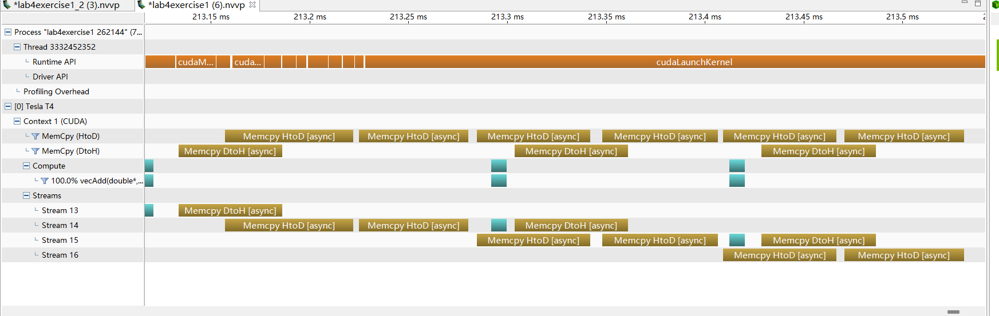

#  Assignment IV: Advanced CUDA

### Exercise 1 - Thread Scheduling and Execution Efficiency 
#### 1. Assume X=800 and Y=600. Assume that we decided to use a grid of 16X16 blocks. That is, each block is organized as a 2D 16X16 array of threads. How many warps will be generated during the execution of the kernel? How many warps will have control divergence? Please explain your answers.

The number of wraps: each block has a $16* 16=400$ array of threads and each warp includes 32 threads. So each block has $16* 16/ 32=8$ wraps. We have $ceil(800/16)* ceil(600/16)=19000$. Totally, we have $19000*8=15200$ warps.

Control divergence: In each block, two rows of threads are in the same wraps. In the X-axis, $800/ 16=50$ blocks, so all of the x-axis threads will have the same control path; In the y-axis, $600/16=37.5$ blocks, which means in the last block, 8 rows have execute one path and the other 8 rows execute one path. But every two rows are in the same wraps, there is also no control divergence. 0 wrap in this condition has control divergence. 

#### 2. Now assume X=600 and Y=800 instead, how many warps will have control divergence? Please explain your answers.

In the X-axis, $600/16=37.5$ blocks, which means in the last column of the blocks, 8 columns of threads and the other 8 columns of threads execute differently. So each of these kinds of blocks has 128 wraps  with control divergence. In the y-axis, $800/16=50$ blocks, so the total warps with control divergence is $8*50=400$.

#### 3. Now assume X=600 and Y=799, how many warps will have control divergence? Please explain your answers.

We divided the control divergence into three conditions: C1, C2, C3.In the X-axis, the same as in question 2, each of these kinds of blocks has 128 wraps  with control divergence. In the y-axis,  $799/16=49$ blocks, so the total wraps with C1 is $49* 8=392$; $799 % 16= 1$, which means 15 rows of threads and the last one row of threads execute different pathes, so one wrap will have control divergence. The total number of wraps with C2 is $37* 1 = 37$. The number of C3 waps is $8$ wraps. Th etotal number is $392+8+37=437$.

### Exercise 2 - CUDA Streams
#### 1. Compared to the non-streamed vector addition, what performance gain do you get? Present in a plot ( you may include comparison at different vector length)


#### 2. Use nvprof to collect traces and the NVIDIA Visual Profiler (nvvp) to visualize the overlap of communication and computation. To use nvvp, you can check Tutorial: NVVP - Visualize nvprof Traces

We use command```nvprof --output-profile lab4exercise1.nvvp -f ./lab4exercise1 262144``` to trace the performance and use nvvp to check the visualized file.

The vector size is set to 262144. From the figure we can see that the overlap of copying data from host to device and copying data from device to host, launching the kernel for computing.


#### 3. What is the impact of segment size on performance? Present in a plot ( you may choose a large vector and compare 4-8 different segment sizes)

### Exercise 3 - Heat Equation with using NVIDIA libraries
#### 1. Run the program with different dimX values. For each one, approximate the FLOPS (floating-point operation per second) achieved in computing the SMPV (sparse matrix multiplication). Report FLOPS at different input sizes in a FLOPS. What do you see compared to the peak throughput you report in Lab2?
We noticed that there are three operations in each iteration: cusparseSpMV, cublasDaxpy and cublasDnrm2 operations. These operations all contain a known number of floating point operations, so we add a FLOPS counter and timer to the code and calculate each second. Floating-point operations: FLOPS = Total Floating-Point Operations / Time.

In the cusparseSpMV operation, assuming that each element in A and temp participates in multiplication and addition operations, there are 2*nzv floating point operations per iteration.

In the cublasDaxpy operation, there are 2*dimX floating point operations per iteration.

In the cublasDnrm2 operation, there are 2*dimX floating point operations per iteration.

We fixed nstep and continuously increased the value of dimX, and obtained the changing pattern of floating-point operations per second as shown in the figure below:

We noticed that although there are certain fluctuations, the amount of floating point operations is basically linearly related to the increase in input data. We were not able to observe peak throughput in this experiment. According to the information, this may be because the iteration of the algorithm limits its operations to short bursts of activity.

#### 2. Run the program with dimX=128 and vary nsteps from 100 to 10000. Plot the relative error of the approximation at different nstep. What do you observe?
In the experiment, we fixed dimX at 128 and continued to increase the number of iterations. From the figure, we can find that the relative error decreases exponentially as the number of iterations increases.

#### 3. Compare the performance with and without the prefetching in Unified Memory. How is the performance impact? 
We design an input as the flag bit FLAG in the code and perform an AND operation with the if condition of prefetch, so that we can control the prefetch operation without modifying the code.

In the experiment, we tested the floating-point number operation volume and the execution time of the iteration at the same time. We noticed that the floating-point number operation volume when using prefetching operation was improved to a certain extent compared with the floating-point number operation volume when not using prefetching operation.

When observing the execution time of iterations, we found that using prefetch operations seems to reduce the execution time of iterations. At the same time, the time consumption of prefetch operations is several orders of magnitude less than the execution time. However, it is worth mentioning that when observing the execution time of the two, we found that there is very large fluctuation in the execution time, and the observation results about the execution time need further verification.
