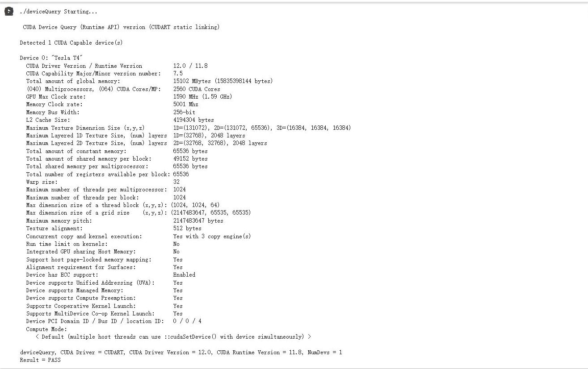

**contribute：** Ruimin Shi did exercises 1 and 4, Bowen Tian did exercises 2 and 3

# Assignment I:

## Exercise 1 - Reflection on GPU-accelerated Computing

#### 1. List the main differences between GPUs and CPUs in terms of architecture.

##### 1. Parallel:
GPU is highly parallel processors which can handle multiple tasks simultaneously. GPU has large number of cores, each capable of executing its own set of instructions independently.

CPU is optimized for single-threaded performance and tasks that require more sequential processing. CPU has higher clock speeds and more complex cores.

##### 2. Number of Cores:
GPU has larger number of simple cores. This allows them to process many simple tasks simultaneously, making them suitable for parallelizable tasks.

CPUs has fewer but more powerful cores that are optimized for handling complex tasks and executing a variety of instructions.

#### 2.Check the latest Top500 list that ranks the top 500 most powerful supercomputers in the world. In the top 10, how many supercomputers use GPUs? Report the name of the supercomputers and their GPU vendor (Nvidia, AMD, ...) and model. 

8 supercomputers ues GPUs in top10.

|     name       | GPU vendor  |     model           | 
|----------------|:-----------:|:-------------------:|
| FRONTIER       | AMD         |	HPE Cray EX235a    |
| LUMI           | AMD         |	HPE Cray EX235a    |
|  Leonardo           | Nvidia        |	BullSequana XH2000    |
|  Summit          | Nvidia        |	IBM Power SystemAC922   |
|  Sierra           | Nvidia        |	IBM Power SystemS922LC   |
|  Perlmutter          | Nvidia        |	HPE Cray EX235a     |
|  Selene           | Nvidia        |	Nvidia |

#### 3. One main advantage of GPU is its power efficiency, which can be quantified by Performance/Power, e.g., throughput as in FLOPS per watt power consumption. Calculate the power efficiency for the top 10 supercomputers. (Hint: use the table in the first lecture)

|     name             | Rpeak (PFlop/s) |    Power (kW)   |  power efficiency   |
|----------------------|:---------------:|:---------------:|:-------------------:|
| FRONTIER             |   1,679.82      |	 22,703        |        0.074        |
| Supercomputer Fugaku |   537.21        |	 29,899        |        0.018        |
| LUMI                 |    428.70       |	6,016          |        0.071        |
|  Leonardo            |        304.47   |	7,404          |        0.041        |
|  Summit              |   200.79	       |	10,096         |      0.020          |
|  Sierra              |    125.71	     |	 7,438         |        0.017        |
|  Sunway TaihuLight   |   125.44        |  15,371         |	     0.008         |
|  Perlmutter          |    93.75	       |	  	2,589      |      0.036          |
|  Selene              | 79.22	         |	2,646          |       0.030         |
|  	Tianhe-2A          | 100.68          |	18,482         |       0.005         |
## Exercise 2 - Query Nvidia GPU Compute Capability

#### 1. The screenshot of the output from running deviceQuery test in /1_Utilities.


#### 2. What is the Compute Capability of your GPU device?
As shown in the output from deviceQuery, the compute capability of the GPU device is "7.5."

#### 3. The screenshot of the output from running bandwidthTest test in /1_Utilities.


#### 4. How will you calculate the GPU memory bandwidth (in GB/s) using the output from deviceQuery? (Hint: memory bandwidth is typically determined by clock rate and bus width, and check what double date rate (DDR) may impact the bandwidth). Are they consistent with your results from bandwidthTest?
To calculate the GPU memory bandwidth (in GB/s) using the output from deviceQuery, the memory bandwidth can be calculated using the following formula:

Memory Bandwidth (GB/s) = Memory Clock Rate (GHz) x Memory Bus Width (bits) / 8

In the provided output, the memory clock rate is 5.001 MHz, and the memory bus width is 256 bits. The memory bandwidth should be:

Memory Bandwidth (GB/s) = 5.001 GHz x 256 bits / 8 x 2 = 320.064 GB/s

The calculated memory bandwidth is approximately 320.064 GB/s based on the output of deviceQuery.


## Exercise 3 - Rodinia CUDA benchmarks and Comparison with CPU

#### 1. Compile both OMP and CUDA versions of your selected benchmarks. Do you need to make any changes in Makefile?
The modifications we need to make to the makefile include paths and compute capabilities.

From exercise we found that the computing capability of Google Colab is "7.5". We specify the target architecture in the Makefile as "-arch sm_75" to support the code running on GPUs with sm_75 computing capabilities.

#### 2. Ensure the same input problem is used for OMP and CUDA versions. Report and compare their execution time. 
particlefilter[CUDA]


particlefilter[OpenMP]


lavaMD(CUDA)


lavaMD(OpenMP)


#### 3. Do you observe expected speedup on GPU compared to CPU? Why or Why not?
We can observe obvious speedup in the benchmark we used, whether particlefilter or lavaMD.

That's because GPU is throughput-oriented, which performs better in computing and memory-intensive applications. But CPU waste much time on control path.

## Exercise 4 - Run a HelloWorld on AMD GPU

#### 1. How do you launch the code on GPU on Dardel supercomputer?

Firstly, allocate for a time slot ```salloc -A edu23.dd2360 -p gpu -N 1 -t 00:10:00```

Then, we compile the HelloWorld.cpp using ```make```

Finally, run the Helloworld file using ```srun -n 1 ./Helloworld```

#### 2. Include a screenshot of your output from Dardel


